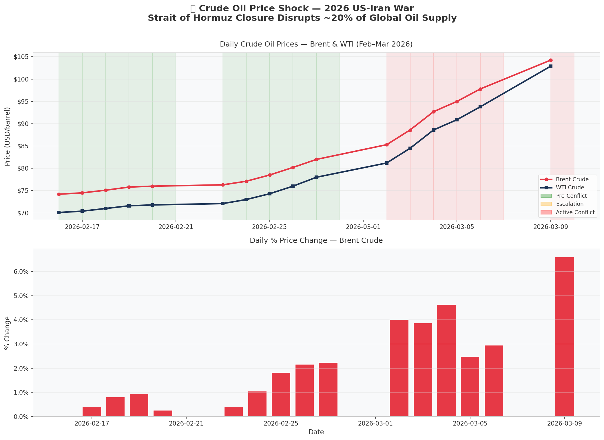
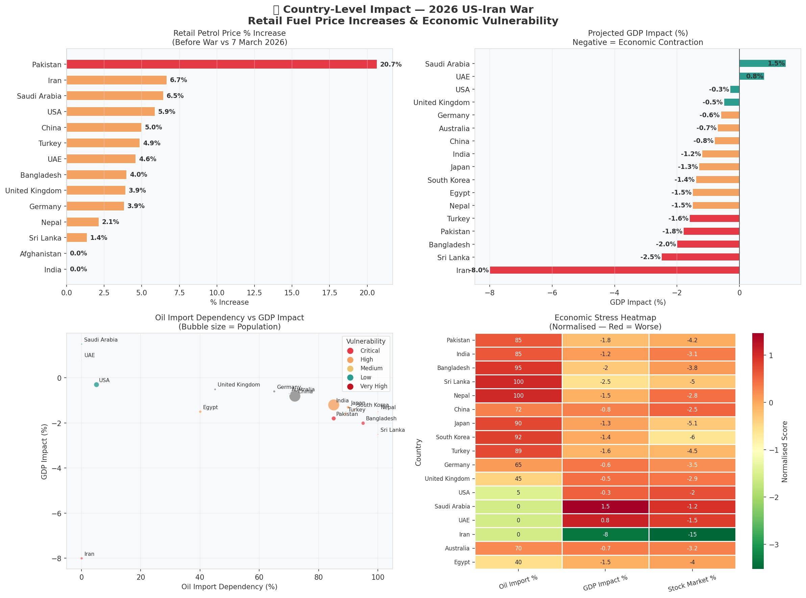
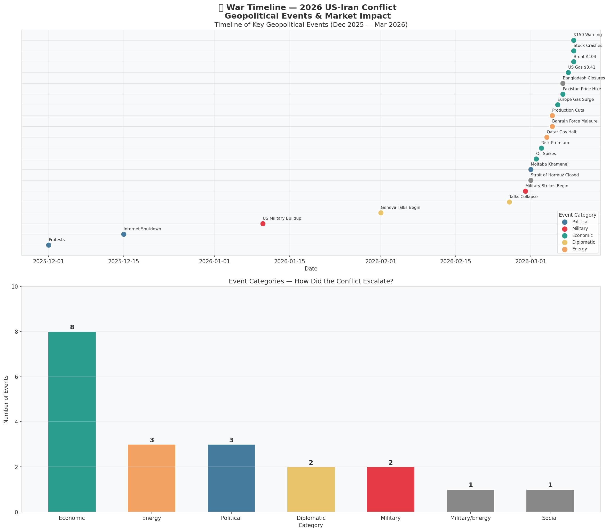
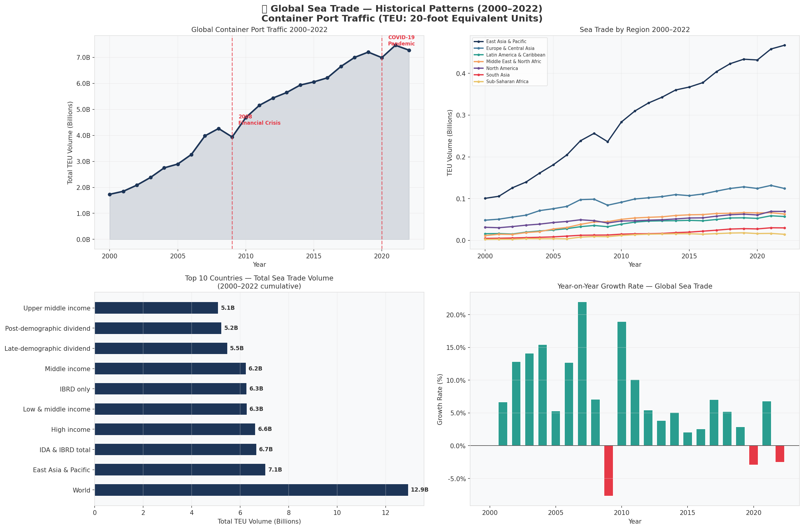
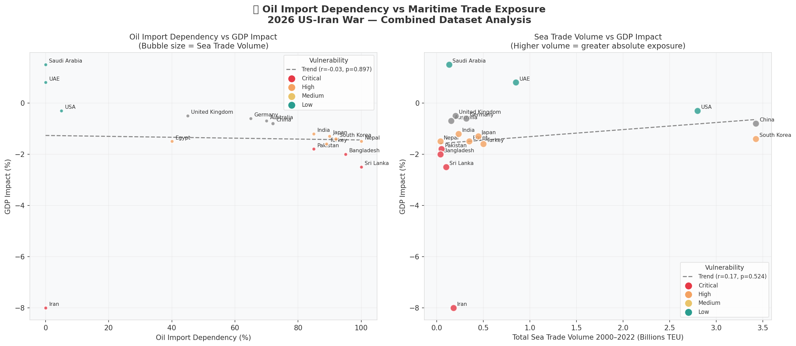
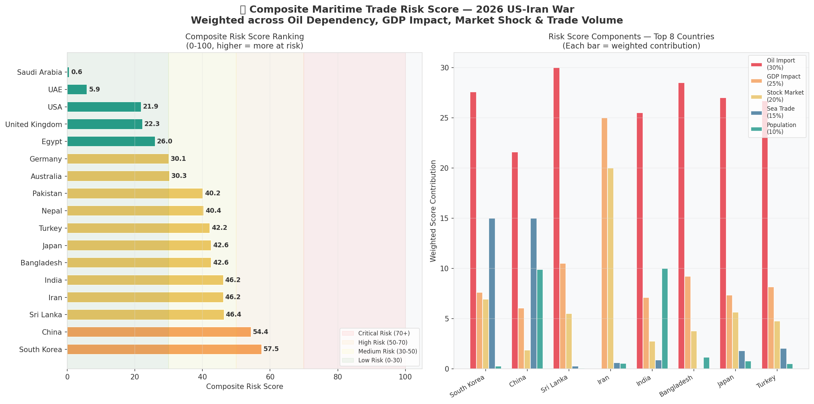
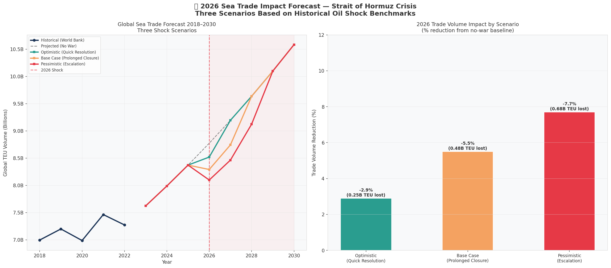
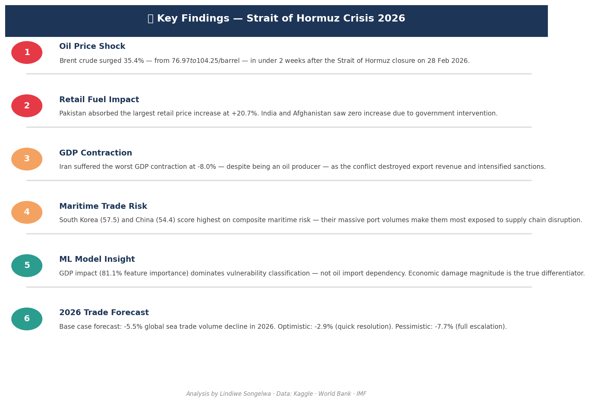

# 🛢️🚢 Strait of Hormuz Crisis 2026
## How the US-Iran War Disrupted Global Oil Markets & Maritime Trade


---

## 📌 Project Overview

On **28 February 2026**, US and Israeli forces conducted strikes on Iranian military 
infrastructure. In response, Iran closed the **Strait of Hormuz** — the world's most 
critical oil chokepoint — disrupting approximately **20% of global oil supply**.

Within days, Brent crude surged from ~$77 to over **$104/barrel**, sending shockwaves 
through fuel prices across 14 countries and threatening the stability of global 
maritime trade.

This project investigates three interconnected research questions using data science, 
machine learning and geopolitical analysis:

| # | Research Question | Approach |
|---|------------------|----------|
| 1 | 🛢️ How severe was the oil price shock? | Time series analysis of daily Brent & WTI prices |
| 2 | 🌍 Which countries were hit hardest? | Country-level vulnerability & economic impact analysis |
| 3 | 🚢 What does this mean for global sea trade? | Historical correlation + 3-scenario forecasting |

---

## 🔑 Key Findings

| Finding | Result |
|---------|--------|
| Brent crude price surge | **+35.4%** ($76.97 → $104.25/barrel) |
| Strait of Hormuz status | Closed/Restricted for **6 of 16** tracked trading days |
| Hardest hit country (fuel) | **Pakistan** (+20.7% retail price increase) |
| Worst GDP contraction | **Iran** (-8.0%) — despite being an oil producer |
| Highest maritime risk | **South Korea** (57.5/100) and **China** (54.4/100) |
| ML model accuracy | **88.9%** (Gradient Boosting, StratifiedKFold CV) |
| Key ML insight | **GDP impact (81.1%)** dominates vulnerability — not oil import dependency |
| Base case trade forecast | **-5.5%** global sea trade volume decline in 2026 |

---

## 📊 Key Findings Gallery

### 🛢️ Oil Price Shock


### 🌍 Country Level Impact


### 📅 War Timeline


### 🚢 Sea Trade Historical Patterns


### 🔗 Correlation Analysis


### 🎯 Composite Risk Scores


### 📈 2026 Forecast Scenarios


### 🤖 ML Model — Feature Importance


### 📋 Intelligence Report


### 🔑 Key Findings Summary


### 💡 Conclusions


---

## 🏗️ Project Structure
```
Strait-of-Hormuz-Crisis-2026/
│
├── 📓 Global_Oil_Maritime_Trade_Analysis.ipynb  ← Main notebook
├── 📋 README.md                                  ← This file
└── 📁 key_findings/                              ← All chart outputs
    ├── chart_01_oil_price_shock.png
    ├── chart_02_country_impact.png
    ├── chart_03_war_timeline.png
    ├── chart_04_sea_trade_patterns.png
    ├── chart_05_correlation.png
    ├── chart_06_risk_scores.png
    ├── chart_07_forecast.png
    ├── chart_08_model.png
    ├── chart_09_intelligence_report.png
    ├── chart_10_key_findings.png
    └── chart_11_conclusions.png
```

---

## 📦 Datasets

| Dataset | Source | Coverage |
|---------|--------|----------|
| Global Petrol Prices — US-Iran War 2026 | [Kaggle (zkskhurram)](https://www.kaggle.com/datasets/zkskhurram/global-petrol-prices-impact-of-2026-us-iran-war) | 14 countries, Feb–Mar 2026 |
| Volume of Goods Transported by Sea | [Kaggle (fareselgohary003)](https://www.kaggle.com/datasets/fareselgohary003/volume-of-goods-transported-by-sea) | 210 countries, 2000–2022 |

---

## 🛠️ Tech Stack

**Languages & Environment**


**Data & Analysis**


**Machine Learning**


**Visualisation**


---

## 📓 Notebook Structure

| Phase | Description |
|-------|-------------|
| 🔧 Phase 0 | Setup & Configuration |
| 📦 Phase 1 | Data Loading & Validation |
| 🔍 Phase 2 | Exploratory Data Analysis (4 sub-sections) |
| 🔗 Phase 3 | Combined Analysis & Risk Scoring |
| 🤖 Phase 4 | Forecasting & ML Modelling |
| 📊 Phase 5 | Final Intelligence Report |
| 💡 Phase 6 | Conclusions & Insights |

---

## 🤖 Models Used

| Model | CV Accuracy | Notes |
|-------|------------|-------|
| Gradient Boosting | **88.9%** ✅ | Selected as best model |
| Random Forest | 70.0% | Strong but lower CV score |
| Logistic Regression | Baseline | Lower performance |

---

## ⚠️ Disclaimer

This project is produced for **educational and portfolio purposes only**.  
It does not constitute financial, investment, or geopolitical advice.  
All data sourced from publicly available datasets on Kaggle and the World Bank.

---

## 👩🏾‍💻 Author

**Lindiwe Songelwa**
*Data Scientist · Developer · Insight Creator*
📍 Gauteng, South Africa 🇿🇦

| Platform | Link |
|----------|------|
| 💼 LinkedIn | [linkedin.com/in/lindiwe-songelwa](https://www.linkedin.com/in/lindiwe-songelwa) |
| 🐙 GitHub | [github.com/Lindiwe-22](https://github.com/Lindiwe-22) |
| 🏅 Credly | [credly.com/users/samnkelisiwe-lindiwe-songelwa](https://www.credly.com/users/samnkelisiwe-lindiwe-songelwa) |
| 📓 Kaggle | [kaggle.com/lindiwe22](https://www.kaggle.com/lindiwe22) |

---

<p align="center">
  <i>© 2026 Lindiwe Songelwa · All rights reserved</i><br>
  <i>Reproduction or redistribution without written permission is prohibited.</i>
</p>
